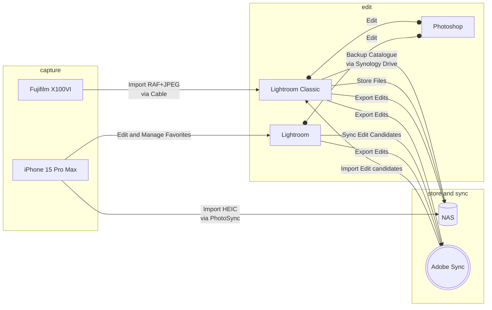

# Photos FLow

```mermaid
flowchart LR

subgraph capture
X100VI[Fujifilm X100VI]
iPhone[iPhone 15 Pro Max]
end

subgraph edit
LrC[Lightroom Classic]
Lr[Lightroom]
Ps[Photoshop]
end

subgraph store and sync
NAS[(NAS)]
AS(((Adobe Sync)))
end

X100VI --Import RAF+JPEG\nvia Cable--> LrC
iPhone --Import HEIC\nvia PhotoSync----> NAS
iPhone --Edit and Manage Favorites--> Lr

LrC --Backup Catalogue\nvia Synology Drive--> NAS
LrC --Store Files--> NAS
LrC o--Edit--o Ps
LrC --Export Edits--> NAS
AS --Import Edit candidates--> LrC
LrC --Export Edits--> AS

Lr o--Edit--o Ps
Lr --Sync Edit Candidates--> AS
Lr --Export Edits--> AS

```
